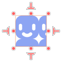
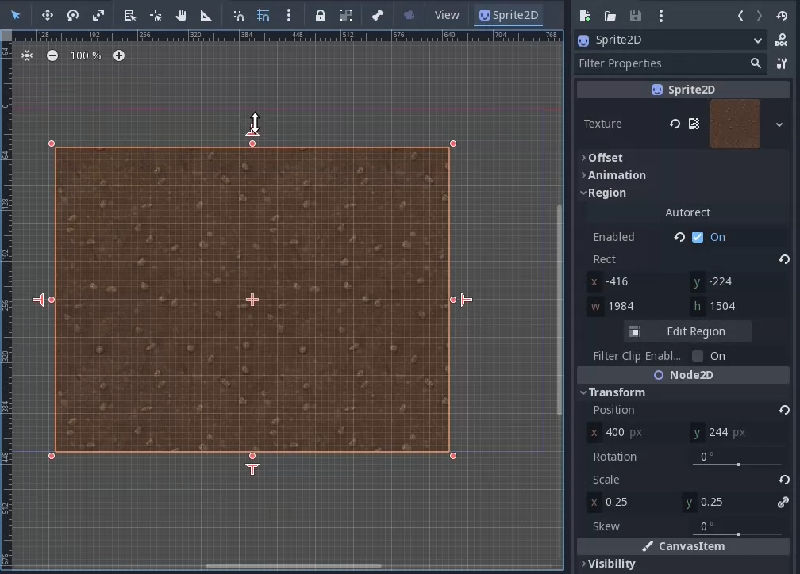

# Sprite2D Rect Editor

This addon allows easier editing of the `region_rect` property of Sprite2D
nodes. The addon was made for Godot 4.1.1. It may work for 4.0 releases but I
haven't tested them.

## Demo (click for video)

## Resizing Handles

When a Sprite2D is selected in the editor and has `region_enabled` checked,
additional handles will appear on each side of the Sprite2D. Dragging these
handles will resize the region rect in the given direction while adjusting the
node's position and the region's x/y/width/height properties such that the
opposite edge stays put.

### Caveats
- The Sprite2D must have `global_rotation` set to a multiple of 2π (e.g. 0). I
  didn't want to have to figure out how to measure drag distance along any
  arbitrary axis, but pull requests are welcome.
- The handles will always snap to 8px increments. Godot doesn't provide a way
  for addons to fetch the editor's configured snap settings ([see this
  issue](https://github.com/godotengine/godot/issues/11180)). You can change the
  snap distance for your project's needs by changing the `grid_size` constant in
  `plugin.gd`.

## Autorect

As a bonus, the plugin adds an "autorect" button to the Sprite2D inspector. When
pressed, it sets `region_enabled` to true and sets the region rect to the size
of the image. This is in contrast to the default behavior which just sets the
rect's dimensions to 0 when you enable the region.
